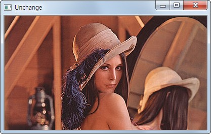

.. _imageStart

#############
이미지 다루기
#############

Goal
====
    * 이미지 파일을 읽고, 보고, 저장하는 방법에 대해서 알아봅니다.
    * 관련 함수인 ``cv2.imread()``, ``cv2.imshow()``, ``cv2.imwrite()`` 에 대해서 알아 봅니다.

이미지 읽기
===========
우선 openCV모듈을 import합니다.:

>>> import cv2

``cv2.imread()`` 함수를 이용하여 이미지 파일을 읽습니다. 이미지 파일의 경로는 절대/상대경로가 가능합니다.

>>> img = cv2.imread('lena.jpg', cv2.IMREAD_COLOR)

.. py:function:: cv2.imread(fileName, flag)

    이미지 파일을 flag값에 따라서 읽어들입니다.

    :param fileName: 이미지파일의 경로
    :type fileName: str
    :param flag: 이미지 파일을 읽을 때의 Option.
    :type flag: int
    :return: image객체 행렬
    :rtype: numpy.ndarray

이미지 읽기의 flag는 3가지가 있습니다.

    * ``cv2.IMREAD_COLOR`` : 이미지 파일을 Color로 읽어들입니다. 투명한 부분은 무시되며, Default값입니다.
    * ``cv2.IMREAD_GRAYSCALE`` : 이미지를 Grayscale로 읽어 들입니다. 실제 이미지 처리시 중간단계로 많이 사용합니다.
    * ``cv2.IMREAD_UNCHANGED`` : 이미지파일을 alpha channel까지 포함하여 읽어 들입니다.

.. note:: 3개의 flag대신에 1, 0, -1을 사용해도 됩니다.

img값은 numpy의 ndarray type입니다. numpy는 python에서 수학적 처리를 위한 모듈로 openCV에서도 많이 사용됩니다.
img가 어떤 형태의 행렬인지 확인을 해보려면 아래와 같이 입력합니다.

>>> img.shape
(206, 207, 3)

이미지는 3차원 행렬로 return이 됩니다. 206은 행(Y축), 207은 열(X축), 3은 행과 열이 만나는 지점의 값이 몇개의
원소로 이루어져 있는지를 나타납니다. 위 값의 의미는 이미지의 사이즈는 207 X 206이라는 의미입니다.

그렇다면 3은 어떤 의미일까요. 바로 색을 표현하는 BGR값입니다. 일반적으로 RGB로 많이 나타내는데, openCV는
B(lue), G(reen), R(ed)로 표현을 합니다.

다음은 읽은 이미지를 보는 방법에 대해서 알아보겠습니다.

이미지 보기
===========

``cv2.imshow()`` 함수는 이미지를 사이즈에 맞게 보여줍니다.

>>> c22.imshow('image', img)
>>> cv2.waitKey(0)
>>> cv2.destroyAllWindows()

.. py:function:: cv2.imshow(title, image)

    읽어들인 이미지 파일을 윈도우창에 보여줍니다.

    :param title: 윈도우 창의 Title
    :type title: str
    :param image: ``cv2.imread()`` 의 return값
    :type image: numpy.ndarray

``cv2.waitKey()`` 는 keyboard입력을 대기하는 함수로 0이면 key입력까지 무한대기이며 특정 시간동안 대기하려면 milisecond값을 넣어주면 됩니다.

``cv2.destroyAllWindows()`` 는 화면에 나타난 윈도우를 종료합니다. 일반적으로 위 3개는 같이 사용됩니다.

**Sample Code**

.. literalinclude:: imageShow.py
    :linenos:
    :name: imageShow

.. figure:: lena.jpg
    :align: center

    Sample Image

아래는 각 flag에 따른 이미지 결과입니다.

.. figure:: ../../_static/01.imageStart/1.jpg
    :align: center

    Original
.. figure:: ../../_static/01.imageStart/2.jpg
    :align: center

    Grayscale

    Unchange

이미지 저장하기
===============
``cv2.imwrite()`` 함수를 이용하여 변환된 이미지나 동영상의 특정 프레임을 저장합니다.

>>> cv2.imwrite('lenagray.png', gray)

.. py:function:: cv2.imwrite(fileName, image)

    image파일을 저장합니다.

    :param fileName: 저장될 파일명
    :type fileName: str
    :param image: 저장할 이미지

**Sample Code**

이미지를 읽어서 esc키를 누르면 종료, 's' key를 누르면 grayscale이미지가 저장이 되는 Sample입니다.
``cv2.waitKey()`` 사용을 잘 보시기 바랍니다.:

.. code-block:: python

    import cv2

    img = cv2.imread('lena.jpg', cv2.IMREAD_GRAYSCALE)
    cv2.imshow('image',img)
    k = cv2.waitKey(0)
    if k == 27: # esc key
        cv2.destroyAllWindow()
    elif k = ord('s'): # 's' key
        cv2.imwrite('lenagray.png',img)
        cv2.destroyAllWindow()

.. warning:: 64bit OS의 경우 k = cv2.waitKey(0) & 0xFF로 bit연산을 수행해야 합니다.

Matplotlib 사용하기
===================

Matplotlib는 다양한 plot기능을 가진 Python Plot Library입니다. 이미지를 zoom하거나 하나의 화면에 여러개의 이미지를
보고자 할 때 유용합니다.

**Sample Code**

.. literalinclude:: imagePlot.py
    :linenos:

**Result**

.. figure:: ../../_static/01.imageStart/4.jpg
    :align: center

    Matplotlib Result

그런데 결과가 좀 이상합니다. 원본은 붉은색 계열인데, 결과는 파란색 계열로 나타납니다.

이유는 openCV는 BGR로 사용하지만, Matplotlib는 RGB로 이미지를 보여주기 때문입니다.

즉 결과 값은 3차원 배열의 값중 첫번째와 세번째 배열값을 서로 바꿔 주여야 합니다.

그럼 변경된 Sample을 보시기 바랍니다.

**Sample Code**

.. literalinclude:: imagePlotRGB.py
    :linenos:

**Result**

.. figure:: ../../_static/01.imageStart/5.jpg
    :align: center

    RGB값은 변경한 결과