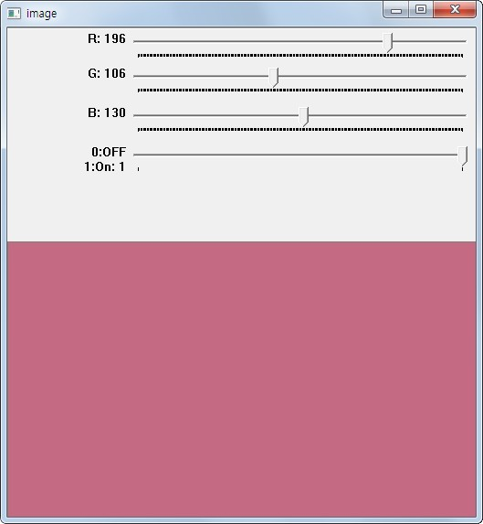

.. _trackBar

========
Trackbar
========

Goal
====
    * trackbar와 OpenCV의 연동 방법에 대해서 알 수 있다.
    * ``cv2.getTrackbarPos()`` , ``cv2.createTrackbar()`` 함수에 대해서 알 수 있다.

Demo
====

Trackbar에 대해서는 간단한 Demo를 보면서 설명하겠습니다.
Demo의 내용은 4개의 Tranckbar로 구성이 되어 있습니다. 3개는 RGB의 값을 표현하며, 나머지 하나는 초기화 하는 기능입니다.

Demo에서 사용하는 ``cv2.getTrackbarPos()`` , ``cv2.createTrackbar()`` 함수에 대해서 알아 보겠습니다.

.. py:function:: cv2.createTrackbar(trackbarName, windowName, value, count, onChange)

    :param trackbarName: trackbar Name
    :param windowName: Named Window
    :param value: Trackbar가 생성될 때 초기 값
    :type value: int
    :param count: Tracbar의 Max값. Min값은 항상 0
    :type value: int
    :param onChange: Slide값이 변경될 때 호출 되는 Callback함수. 전달되는 Paramter는 trackbar Position

.. py:function:: cv2.getTrackbarPos(trackbarName, windowName)

    :param trackbarName: trackbar Name
    :param windowName: Trackbar가 등록된 Named Window

**Sample Code**

.. literalinclude:: trackbar.py
    :linenos:

