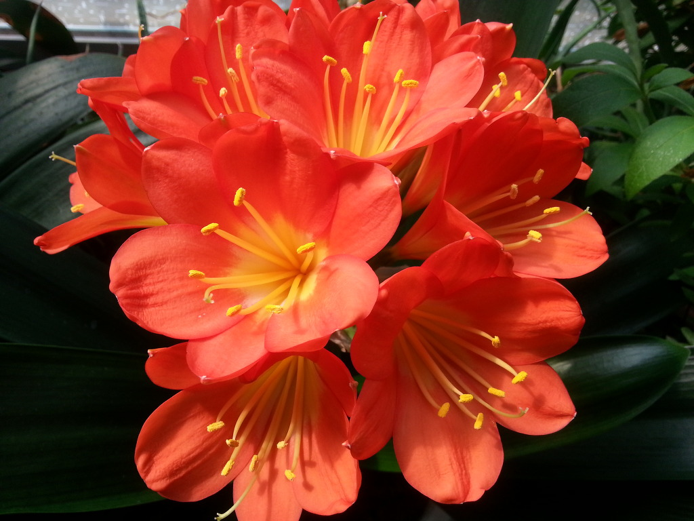
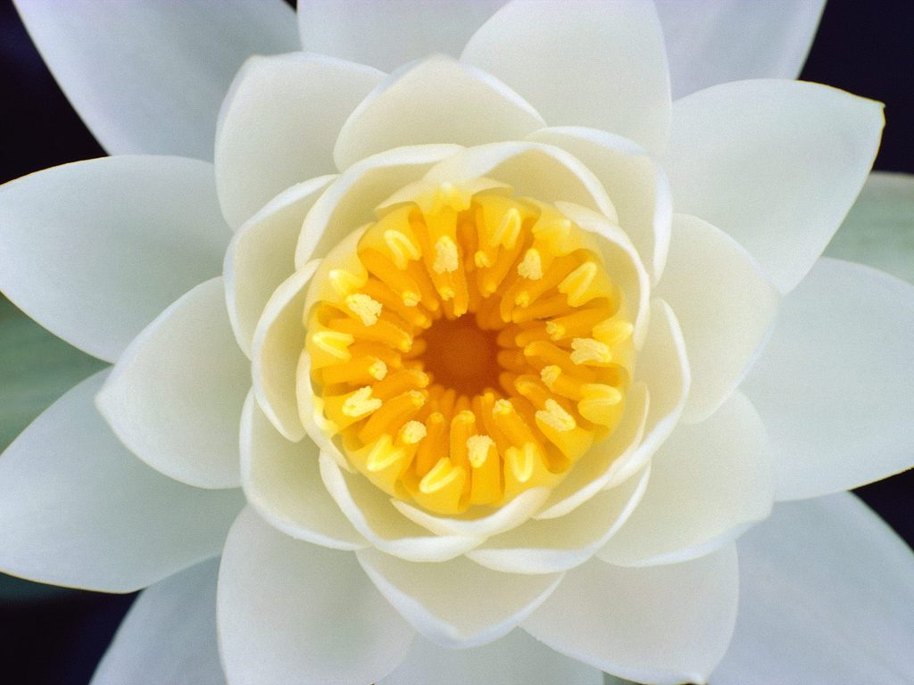

.. _imageArithmetic

========
이미지 연산
========

Goal
====
    * 이미지의 더하기, 빼기, 비트연산에 대해서 알 수 있다.
    * ``cv2.add()`` , ``cv2.addWdighted()`` 함수에 대해서 알 수 있다.

이미지 더하기
==========

| 이미지를 더하는 방법은 OpenCV의 ``cv2.add()`` 함수를 사용하는 방법과
| Numpy 연산,  즉 img1 + img2로 하는 방법이 있습니다. 둘다 더하는 것은 같지만 결과는 다르게 나타납니다.

| OpenCV의 ``cv2.add()`` 는 Saturation 연산을 하고, Numpy는 modulo 연산을 합니다.

.. note::
    | Saturation연산은 한계값을 정하고 그 값을 벗어나는 경우는 모두 특정 값으로 계산하는 방식 입니다.
    | 이미지에서는 0이하는 모두 0, 255이상은 모두 255로 표현하는 것입니다.
    | modulo연산은 a와 b는 n으로 나눈 나머지 값이 같다라는 의미입니다.
    | 시계를 예로 들면 2와 14는 12로 나눈 나머지가 2로 동일합니다. 이미지에서는 연산의 결과가 256보다 큰 경우는 256으로 나눈 나머지 값으로 결정을 합니다.

예제로 OpenCV와 Numpy의 결과가 어떻게 다른지 보겠습니다.

.. code-block::python

    import cv2
    import numpy as np

    img1 = cv2.imread('images/flower1.jpg')
    img2 = cv2.imread('images/flower2.jpg')

    # 2개의 이미지를 더하기 위해서는 각 이미지의 사이즈와 channel이 같아야 함.(shape)
    cvImg = cv2.add(img1, img2)
    numpyImg = img1 + img2

    cv2.imshow('flower1', img1)
    cv2.imshow('flower2', img2)
    cv2.imshow('opencv', cvImg)
    cv2.imshow('numpy', numpyImg)

    cv2.waitKey(0)

    cv2.destroyAllWindows()

    Original 1

    Original 2

.. figure:: ../../_static/07.imageArithmetic/opencv.jpg
    :align: center

    OpenCV Add

.. figure:: ../../_static/07.imageArithmetic/numpy.jpg
    :align: center

    Numpy Add

이미지 Blending
=============

이미지를 서로 합칠 때 가중치를 두어 합치는 방법입니다.

.. math::

    g(x) = (1 - \alpha)f_{0}(x) + \alpha f_{1}(x)

a 값이 0 -> 1로 변함에 따라서 이미지가 전환된다.

아래 예제는 trackbar의 값을 조정함에 따라서 이미지가 변환되는 예제입니다.

**Sample Code**

.. code-block:: python
    :linenos:

    #-*- coding:utf-8 -*-
    import cv2
    import numpy as np

    img1 = cv2.imread('images/flower1.jpg')
    img2 = cv2.imread('images/flower2.jpg')

    def nothing(x):
        pass

    cv2.namedWindow('image')
    cv2.createTrackbar('W', 'image', 0, 100, nothing)

    while True:

        w = cv2.getTrackbarPos('W','image')

        dst = cv2.addWeighted(img1,float(100-w) * 0.01, img2,float(w) * 0.01,0)

        cv2.imshow('dst', dst)

        if cv2.waitKey(1) &0xFF == 27:
            break;

    cv2.destroyAllWindows()

**Result**

.. figure:: ../../_static/07.imageArithmetic/result01.jpg
    :align: center

비트연산
======

비트연산은 AND, OR, NOT, XOR연산을 말한다. 비트연산은 이미지에서 특정 영역을 추출할 때 유용하게 사용된다.
예를 들면 이미지에서 바탕을 제거하고, 2개의 이미지를 합치는 경우입니다.

아래는 OpenCV Logo에서 바탕을 제거하고, 이미지에 추가하는 예제입니다.

**Sample Code**

.. literalinclude:: imageBitwise.py
    :linenos:

**Result**

.. figure:: ../../_static/07.imageArithmetic/result02.jpg
    :align: center

참고로 이미지 처리시 많이 사용되는 ``cv2.threshold()`` 함수에 대해서 다음 장에서 알아보겠습니다.

