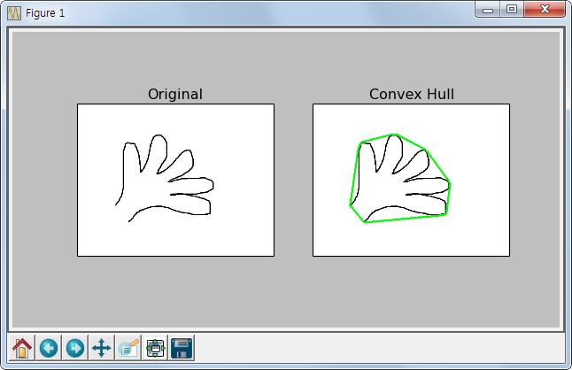

.. imageContourFeature

===============
Contour Feature
===============

Goal
====
    * Contours의 특징(영역, 중심점, bounding box 등)을 찾을 수 있습니다.
    * Contours 특징을 찾는 다양한 함수에 대해서 알 수 있습니다.

Moments
=======

Image Moment는 대상을 구분할 수 있는 특징을 의미합니다.. 특징으로는 Area, Perimeter, 중심점 등이 있습니다.
Image Moments는 대상을 구분한 후, 다른 대상과 구분하기 위해 대상을 설명(describe)하는 자료로 사용됩니다.

.. code-block:: python
    :linenos:

    #-*- coding:utf-8 -*-
    import cv2
    import numpy as np

    img = cv2.imread('images/rectangle.jpg')
    imgray = cv2.cvtColor(img,cv2.COLOR_BGR2GRAY)
    ret, thresh = cv2.threshold(imgray,127,255,0)

    image, contours, hierachy = cv2.findContours(thresh, cv2.RETR_TREE,cv2.CHAIN_APPROX_SIMPLE)

    # 첫번째 contours의 moment 특징 추출
    cnt = contours[0]
    M = cv2.moments(cnt)

    print M.items()

>>> [('mu02', 35950058.66666663), ('mu03', 1.52587890625e-05), ('m11', 884446080.0), ('nu02', 0.03873697916666662), ('m12', 113614624853.33333), ('mu21', 1.9073486328125e-05), ('mu20', 166374058.6666665), ('nu20', 0.17927170868347322), ('m30', 570292325120.0), ('nu21', 1.1775050154231546e-16), ('mu11', 0.0), ('mu12', 3.814697265625e-06), ('nu11', 0.0), ('nu12', 2.3550100308463093e-17), ('m02', 463733162.6666666), ('m03', 63472543680.0), ('m00', 30464.0), ('m01', 3609984.0), ('mu30', 0.0001220703125), ('nu30', 7.53603209870819e-16), ('nu03', 9.420040123385237e-17), ('m10', 7463680.0), ('m20', 1994975658.6666665), ('m21', 236404615552.0)]

위 Dictionary Data에는 contours의 특징을 찾을 수 있는 기본 정보들이 있습니다(총 24개). 예를 들면 Contour의 중심값을 찾기 위해서는 아래 값을 사용하면 됩니다.

>>> cx = int(M['m10']/M['m00'])
>>> cy = int(M['m01']/M['m00'])

Contour Area
------------

Contour면적은 moments의 ``m00`` 값이거나 ``cv2.contourArea()`` 함수로 구할 수 있다.

>>> cv2.contourArea(cnt)
30464.0

Contour Perimeter
-----------------

Contour의 둘레 길이를 구할 수 있습니다. 사각형의 경우는 둘레길이의 합이 됩니다. 아래 함수의 2번째 argument가 true이면 폐곡선 도형을 만들어
둘레길이를 구하고, False이면 시작점과 끝점을 연결하지 않고 둘레 길이를 구합니다.

>>> cv2.arcLength(cnt, True)
750.0
>>> cv2.arcLength(cnt, False)
494.0

Contour Approximation
---------------------

``cv2.findContours()`` 함수에 의해서 찾은 contours line은 각각의 contours point를 가지고 있습니다. 이 Point를 연결하여 Line을 그리게 됩니다.
이때 이 point의 수를 줄여 근사한 line을 그릴 때 사용되는 방법입니다.

Point의 수를 줄이는데 사용되는 방식은 `Douglas-Peucker algorithm <https://en.wikipedia.org/wiki/Ramer-Douglas-Peucker_algorithm>`_ 입니다.

근사치를 찾는데 사용되는 함수는 ``cv2.approxPolyDP()`` 입니다.

.. py:function:: cv2.approxPolyDP(curve, epsilon, closed[, approxCurve]) → approxCurve

    :param curve: contours point array
    :param epsilon: original cuve와 근사치의 최대거리. 최대거리가 클 수록 더 먼 곳의 Point까지 고려하기 때문에 Point수가 줄어듬.
    :param closed: 폐곡선 여부
    :return: 근사치가 적용된 contours point array

아래 예제는 epsilon의 크기를 다르게 한 결과 입니다.

**Sample Code**

.. code-block:: python
    :linenos:

    #-*- coding:utf-8 -*-
    import cv2
    import numpy as np
    from matplotlib import pyplot as plt

    img = cv2.imread('images/bad_rect.png')
    img1 = img.copy()
    img2 = img.copy()

    imgray = cv2.cvtColor(img,cv2.COLOR_BGR2GRAY)
    ret, thresh = cv2.threshold(imgray,127,255,0)

    image, contours, hierachy = cv2.findContours(thresh, cv2.RETR_TREE,cv2.CHAIN_APPROX_SIMPLE)

    cnt = contours[0]

    # 적용하는 숫자가 커질 수록 Point의 갯수는 감소
    epsilon1 = 0.01*cv2.arcLength(cnt, True)
    epsilon2 = 0.1*cv2.arcLength(cnt, True)

    approx1 = cv2.approxPolyDP(cnt, epsilon1, True)
    approx2 = cv2.approxPolyDP(cnt, epsilon2, True)

    cv2.drawContours(img, [cnt],0,(0,255,0),3) # 215개의 Point
    cv2.drawContours(img1, [approx1], 0,(0,255,0), 3) # 21개의 Point
    cv2.drawContours(img2, [approx2], 0,(0,255,0), 3) # 4개의 Point

    titles = ['Original', '1%', '10%']
    images = [img, img1, img2]

    for i in xrange(3):
        plt.subplot(1,3,i+1), plt.title(titles[i]), plt.imshow(images[i])
        plt.xticks([]), plt.yticks([])

    plt.show()

**Result**

.. figure:: ../../_static/16.imageContourFeature/result01.jpg
    :align: center

Convex Hull
-----------
Convex Hull이란 contours point를 모두 포함하는 볼록한 외관선을 의미합니다.
Contour Approximation과 유사한 결과지만, 방법은 전혀 다릅니다.

아래 그림에서 붉은 선이 Convex Hull을 나타내고 화살표의 차이가 convexity defect라고 합니다. convexity defect는 contours와 hull과의 최대차이를 나타냅니다.

.. figure:: ../../_static/16.imageContourFeature/image01.jpg
    :align: center

Convex Hull에 대한 예제입니다.

**Sample Code**

.. code-block:: python
    :linenos:

    #-*- coding:utf-8 -*-
    import cv2
    import numpy as np
    from matplotlib import pyplot as plt

    img = cv2.imread('images/hand.png')
    img1 = img.copy()

    imgray = cv2.cvtColor(img,cv2.COLOR_BGR2GRAY)
    ret, thresh = cv2.threshold(imgray,127,255,0)

    image, contours, hierachy = cv2.findContours(thresh, cv2.RETR_TREE,cv2.CHAIN_APPROX_SIMPLE)

    cnt = contours[1] # 1이 손모양 주변의 contour
    hull = cv2.convexHull(cnt)

    cv2.drawContours(img1, [hull], 0,(0,255,0), 3)

    titles = ['Original','Convex Hull']
    images = [img, img1]

    for i in xrange(2):
        plt.subplot(1,2,i+1), plt.title(titles[i]), plt.imshow(images[i])
        plt.xticks([]), plt.yticks([])

    plt.show()

**Result**

Checking Convexity
------------------

``cv2.isContourConvex()`` 함수는 contour가 convex인지 아닌지 판단하여 True 또는 False를 Return합니다.
여기서 convex란 contour line이 볼록하거나 최소한 평평한 것을 의미합니다.(오목한 부분이 없는 것입니다.)

위 예제에는 2개의 contour가 있는데, 첫번째는 이미지의 전체 외곽선(사각형)이고 두번째는 손 모양의 contour line입니다.
그래서 결과는 아래와 같습니다.

>>> cv2.isContourConvex(contours[0]) # 외곽선 contour line
True
>>> cv2.isContourConvex(contours[1]) # 손 모양 contour line
False

Bounding Rectangle
------------------

Contours Line을 둘러싸는 사각형을 그리는 방법입니다. 사각형을 그리는 방법은 2가지가 있습니다.

#. **Straight Bounding Rectangle** : 대상의 Rotation은 무시한 사각형 모양입니다.

.. code-block:: python

    x,y,w,h = cv2.boundingRect(cnt)
    img = cv2.rectangle(img,(x,y),(x+w,y+h),(0,255,0),2)

#. **Rotated Rectangle** : 대상을 모두 포함하면서, 최소한의 영역을 차지하는 사각형 모양입니다.

.. code-block:: python

    rect = cv2.minAreaRect(cnt)
    box = cv2.boxPoints(rect)
    box = np.int0(box)
    im = cv2.drawContours(im,[box],0,(0,0,255),2)

Minumum Enclosing Circle
------------------------

Contours line을 완전히 포함하는 원 중 가장 작은 원을 그릴 수 있습니다.

.. code-block:: python

    (x,y),radius = cv2.minEnclosingCircle(cnt)
    center = (int(x),int(y))
    radius = int(radius)
    img = cv2.circle(img,center,radius,(0,255,0),2)

Fitting an Ellipse
------------------

Contours Line을 둘러싸는 타원을 그릴 수 있습니다.

.. code-block:: python

    ellipse = cv2.fitEllipse(cnt)
    im = cv2.ellipse(im,ellipse,(0,255,0),2)

아래는 전체 예제입니다.

**Sample Code**

.. code-block:: python
    :linenos:

    #-*- coding:utf-8 -*-
    import cv2
    import numpy as np
    from matplotlib import pyplot as plt

    img = cv2.imread('images/lightning.jpg')
    img1 = img.copy()

    imgray = cv2.cvtColor(img,cv2.COLOR_BGR2GRAY)
    ret, thresh = cv2.threshold(imgray,127,255,0)

    image, contours, hierachy = cv2.findContours(thresh, cv2.RETR_TREE,cv2.CHAIN_APPROX_SIMPLE)

    cnt = contours[1]

    # Straight Rectangle
    x, y, w, h = cv2.boundingRect(cnt)
    img1 = cv2.rectangle(img1,(x,y),(x+w, y+h),(0,255,0), 3) # green

    # Rotated Rectangle
    rect = cv2.minAreaRect(cnt)
    box = cv2.boxPoints(rect)
    box = np.int0(box)
    img1 = cv2.drawContours(img1, [box], 0, (0,0,255), 3) # blue

    # Minimum Enclosing Circle
    (x,y), radius = cv2.minEnclosingCircle(cnt)
    center = (int(x), int(y))
    radius = int(radius)
    img1 = cv2.circle(img1, center, radius,(255,255,0),3) # yellow

    # Fitting an Ellipse
    ellipse = cv2.fitEllipse(cnt)
    img1 = cv2.ellipse(img1, ellipse,(255,0,0),3) #red

    titles = ['Original','Result']
    images = [img, img1]

    for i in xrange(2):
        plt.subplot(1,2,i+1), plt.title(titles[i]), plt.imshow(images[i])
        plt.xticks([]), plt.yticks([])

    plt.show()

**Result**

.. figure:: ../../_static/16.imageContourFeature/result03.jpg
    :align: center
