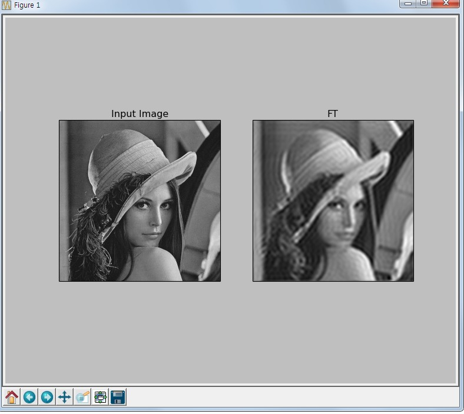

.. imageFourierTransform

===========
푸리에 변환
===========

Goal
====

    * Numpy와 OpenCV를 이용하여 푸리에 변환을 찾을 수 있다.
    * 푸리에 변환을 이용하여 이미지를 변환할 수 있다.

푸리에 변환
===========

푸리에 변환은 주파수를 분석하는데 사용되는 방법입니다. 주파수는 시간의 흐름에 따른 진동하는 파동의 횟수를 의미합니다.
이때 파동은 Sin, cos의 삼각함수로 표현할 수 있는데, 이렇게 되면 시간축을 제거하고 파동의 전체적인 모습을 한눈에 볼 수 있게 됩니다.

즉, 무한대의 시간축이 제거가 되고 주파수의 관점에서 분석이 가능해집니다.
아래 그래프를 보면 이해가 좀 쉽게 될 수 있습니다.

.. figure:: ../../_static/23.imageFourierTransform/image01.png
    :align: center

.. figure:: ../../_static/23.imageFourierTransform/image02.png
    :align: center

    시간 도메인을 주파수 도메인으로 변환한 결과(출처 : `Incodom <http://www.incodom.kr/%ED%91%B8%EB%A6%AC%EC%97%90_%EB%B3%80%ED%99%98>`_ )

수학에서는 어떤 문제를 풀기가 어려운 경우, 다른 형태으로 변형하여 문제를 해결하는 경우가 많습니다.
페르마의 정리를 증명할때 증명이 어려워, 해당 방정식을 타원방정식으로 변환하여 타원 방정식의 공식으로 증명을 한 경우도 있습니다.

푸리에 변환도 마찬가지로 변환을 통해서 수학적으로 문제를 해결하는 방법입니다.

그럼 이미지에 푸리에 변환이 어떻게 적용이 될까요. 이미지도 파동으로 변환을 할 수가 있는데, 주변 픽셀과의 밝기 변환가 많은 곳은 고주파로,
변환이 적은 곳은 저주파로 표현이 가능합니다.

즉, 이미지에서 고주파의 의미는 경계선을 의미하고, 저주파는 배경을 의미합니다. 그러므로 고주파를 제거하면 경계선이 사라지고,
저주파를 제거하면 경계선만 남게 됩니다.

이미지 -> 푸리에 변환 -> 고주파 또는 저주파 제거 -> 다시 이미지 변환 과정을 거쳐 경계 또는 배경만 남게 할 수 있습니다.

푸리에 변환 With Numpy
======================

아래는 Numpy를 이용한 푸리에 변환 결과 입니다.

**Sample Code**

.. code-block:: python
    :linenos:

    #-*- coding:utf-8 -*-

    """
    # Fourier Transform(푸리에 변환)
        . 시간 도메인(X축)에서 표현된 신호(일반적인 파형 도표)를 주파수 도메인으로 변환.
        . 시간축이 제거되어 대상의 전체적인 특징을 파악할 수 있음.
        . 이미지에 적용이 되어 중심이 저주파 영역, 주변이 고주파 영역을 나타냄.
        . 푸리에 변환을 하여 저주파 또는 고주파를 제거하고 다시 역으로 이미지로 변환 함으로써
          이미지가공을 할 수 있음.
          (ex; 푸리에 변환 후 중심의 저주파를 제거하고 다시 Image로 전환 하면 이미지의 경계선만 남게 됨.
               푸리에 변환 후 주변의 고주파를 제거하면 모아레 패턴(휴대폰으로 모니터를 찍었을 때 나타나는 현상)
               을 제거할 수 있음.(모니터의 고주파를 제거함.)
          )
    """
    import cv2
    import numpy as np
    from matplotlib import pyplot as plt

    img = cv2.imread('images/lena.jpg')
    b,g,r = cv2.split(img)
    img = cv2.merge([r,g,b])
    img = cv2.cvtColor(img, cv2.COLOR_BGR2GRAY)
    """
    # Fourier Transform을 적용.
     적용을 하면 0,0, 즉 화면 좌측상단점이 중심이고, 거기에 저주파가 모여 있음.
     분석을 용이하게 하기 위해 0,0을 이미지의 중심으로 이동 시키고 Log Scaling을 하여 분석이 용이한 결과값으로 변환
    """
    f = np.fft.fft2(img) # 이미지에 푸리에 변환 적용
    fshift = np.fft.fftshift(f) #분석을 용이하게 하기 위해 주파수가 0인 부분을 중앙에 위치시킴. 중앙에 저주파가 모이게 됨.
    magnitude_spectrum = 20*np.log(np.abs(fshift)) #spectrum 구하는 수학식.

    rows, cols = img.shape
    crow, ccol = rows/2, cols/2 # 이미지의 중심 좌표

    # 중앙에서 10X10 사이즈의 사각형의 값을 1로 설정함. 중앙의 저주파를 모두 제거
    # 저주파를 제거하였기 때문에 배경이 사라지고 경계선만 남게 됨.
    d = 10
    fshift[crow-d:crow+d, ccol-d:ccol+d] = 1

    #푸리에 변환결과를 다시 이미지로 변환
    f_ishift = np.fft.ifftshift(fshift)
    img_back = np.fft.ifft2(f_ishift)
    img_back = np.abs(img_back)

    #threshold를 적용하기 위해 float type을 int type으로 변환
    img_new = np.uint8(img_back);
    ret, thresh = cv2.threshold(img_new,30,255,cv2.THRESH_BINARY_INV)

    plt.subplot(221),plt.imshow(img, cmap = 'gray')
    plt.title('Input Image'), plt.xticks([]), plt.yticks([])

    plt.subplot(222),plt.imshow(magnitude_spectrum, cmap = 'gray')
    plt.title('Spectrum'), plt.xticks([]), plt.yticks([])

    plt.subplot(223),plt.imshow(img_back, cmap = 'gray')
    plt.title('FT'), plt.xticks([]), plt.yticks([])

    plt.subplot(224),plt.imshow(thresh, cmap = 'gray')
    plt.title('Threshold With FT'), plt.xticks([]), plt.yticks([])
    plt.show()

**Result**

.. figure:: ../../_static/23.imageFourierTransform/result01.jpg
    :align: center

    Numpy를 이용한 푸리에 변환 결과

푸리에 변환 with OpenCV
=======================

이번 예제는 OpenCV를 통한 푸리에 변환입니다. 위 예제와는 다르게 고주파 영역을 제거하는 예제입니다.

**Sample Code**

.. code-block:: python
    :linenos:

    import numpy as np
    import cv2
    from matplotlib import pyplot as plt

    img = cv2.imread('images/lena_gray.png',0)
    dft = cv2.dft(np.float32(img),flags = cv2.DFT_COMPLEX_OUTPUT)

    dft_shift = np.fft.fftshift(dft)
    magnitude_spectrum = 20*np.log(cv2.magnitude(dft_shift[:,:,0],dft_shift[:,:,1]))

    rows, cols = img.shape
    crow,ccol = rows/2 , cols/2

    # 아래는 d 사이지의 사각형을 생성한 후, 사각형 바깥쪽을 제거하는 형태임.
    # 즉, 고주파영역을 제거하게 됨.
    # d값이 작을수록 사각형이 작고, 바깥영역 즉, 고주파영역이  많이 제거되기 때문에 이미지가 뭉게지고
    # d값이 클수록 사각형이 크고, 바깥영역 즉, 고주파 영역이 적게 제거되기 때문에 원래 이미지와 가까워짐.

    d = 30
    mask = np.zeros((rows,cols,2),np.uint8)
    mask[crow-d:crow+d, ccol-d:ccol+d] = 1
    # apply mask and inverse DFT
    fshift = dft_shift*mask
    f_ishift = np.fft.ifftshift(fshift)
    img_back = cv2.idft(f_ishift)
    img_back = cv2.magnitude(img_back[:,:,0],img_back[:,:,1])

    plt.subplot(121),plt.imshow(img, cmap = 'gray')
    plt.title('Input Image'), plt.xticks([]), plt.yticks([])
    plt.subplot(122),plt.imshow(img_back, cmap = 'gray')
    plt.title('FT'), plt.xticks([]), plt.yticks([])
    plt.show()

**Result**

