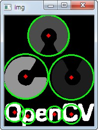

.. imageHoughCircleTransform

======================
Hough Circle Transform
======================

Goal
====
	
	* 이미지에서 원을 찾을 수 있는 허프변환에 대해서 알 수 있다.
	* ``cv2.HoughCircles()`` 함수에 대해서 알 수 있다.

Theory
======

원은 수학적으로 아래와 같이 표현이 됩니다.

.. math::

	{ (x-{ x }_{ center }) }^{ 2 }\quad +\quad { (y\quad -\quad { y }_{ center }) }^{ 2 }\quad =\quad { r }^{ 2 }

위 수식에서는 3개의 변수가 있습니다. 이것을 모든 점에 대해서 수행을 하게 되면 상당히 비효율적입니다. 그래서 openCV에서는 가장자리에서 기울기를 측정하여 원을 그리는데 관련이 있는 점인지 확인할 수 있는 Hough Gradient Method를 사용합니다.

.. py:function:: cv2.HoughCircles(image, method, dp, minDist[, circles[, param1[, param2[, minRadius[, maxRadius]]]]]) → circles

    :param image: 8-bit single-channel image. grayscale image.
    :param method: 검출 방법. 현재는 HOUGH_GRADIENT가 있음. 
    :param dp: dp=1이면 Input Image와 동일한 해상도.
    :param minDist: 검출한 원의 중심과의 최소거리. 값이 작으면 원이 아닌 것들도 검출이 되고, 너무 크면 원을 놓칠 수 있음.
    :param param1: 내부적으로 사용하는 canny edge 검출기에 전달되는 Paramter
    :param param2: 이 값이 작을 수록 오류가 높아짐. 크면 검출률이 낮아짐. 
    :param minRadius: 원의 최소 반지름. 
    :param maxRadius: 원의 최대 반지름. 
    

**Sample Code**

.. code-block:: python
	:linenos:

	#-*-coding:utf-8-*-

	import cv2
	import numpy as np

	img = cv2.imread('images\copy.png',0)
	img = cv2.medianBlur(img,5)
	cimg = cv2.cvtColor(img,cv2.COLOR_GRAY2BGR)

	circles = cv2.HoughCircles(img, cv2.HOUGH_GRADIENT, 1, 20,param1=50,param2=25,minRadius=0, maxRadius=0)

	circles = np.uint16(np.around(circles))

	for i in circles[0,:]:
	    cv2.circle(cimg,(i[0],i[1]),i[2],(0,255,0),2)
	    cv2.circle(cimg,(i[0],i[1]),2,(0,0,255),3)

	cv2.imshow('img', cimg)
	cv2.waitKey(0)
	cv2.destroyAllWindows()

**Result**

