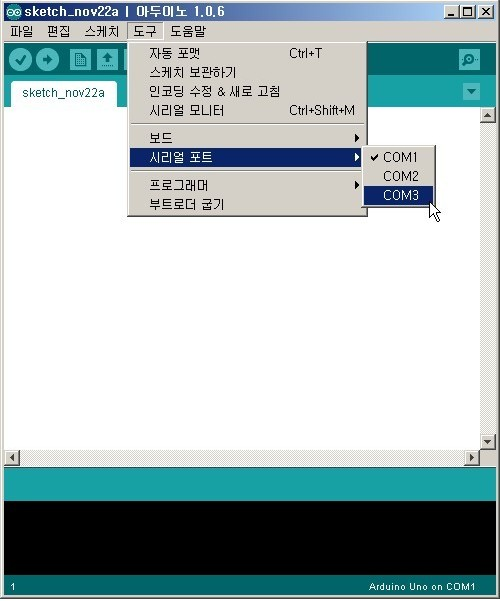

.. demo.rst

==========
Demo 준비1
==========

사전 준비 작업
=============

Demo를 위해서는 아래 프로그램이 설치가 되어 있어야 합니다.

	* Python 2.7.X 버전 
	* Open CV 2.4.X 버전 
	* Python Library : numpy, Pygame. piSerial 

또한 Raspberry Pi에 Pi Camera와 거리 측정을 위한 ultrasonic Sensor가 연결되어 있어야 합니다.

Demo소스 다운로드
================

Demo에 관련 소스는 `Github <https://github.com/hamuchiwa/AutoRCCar>`_ 에서 확인할 수 있습니다.

git이 설치가 되어 있으면 terminal에서 아래와 같이 입력합니다.

>>> git clone https://github.com/hamuchiwa/AutoRCCar.git

git이 없으면 아래 'Clone or download'버튼을 눌러 zip 파일을 다운로드 받은 후 압축을 해제합니다.

.. figure:: ../../_static/99.demo/image01.jpg
    :align: center

동일한 작업을 Computer와 Raspberry Pi에서 수행을 하여 소스를 다운 받습니다.

소스 수정 
========

다운 받은 소스에서 아래 부분을 Demo환경에 맞게 수정해야 합니다.

아두이노 
-------

	* arduino/rc_keyboard_control.ino

.. code-block:: c

	// 아두이노와 RC Car와 연결된 Pin Number.
	// 아래 번호를 수정하거나, 아래 Pin에 맞게 RC Car와 연결.
	// 아래는 demo에 맞게 변경된 상태임.
	int right_pin = 10;
	int left_pin = 9;
	int forward_pin = 6;
	int reverse_pin = 7;	

수정을 한 후에 아두이노 IDE를 통해서 컴파일 후 배포를 합니다.

Computer
--------

	* computer/xxxx.py

computer폴더 밑에 py소스들을 열어 보면 아래와 같은 부분이 있는 소스가 있습니다.

.. code-block:: python
	
	self.server_socket.bind(('192.168.1.100', 8000))	
	self.ser = serial.Serial('/dev/tty.usbmodem1421', 115200, timeout=1)

첫번째 라인은 Raspberry pI와 통신을 하기 위한 Socket IP입니다. PC의 IP로 변경을 합니다.
두번째 라인은 아두이노와 통신하기 위한 Serial Port입니다. 어떤 Serial Port를 사용하는지 확인은 아두이노 IDE에서 확인이 가능합니다.

Raspberry Pi    
------------

	* raspberryPi/xxxxxx.py

라즈베리파이 관련해서는 이미지를 전송하는 Client(``stream_clinet.py``)와 거리 측정을 위한 Client(``ultrasoni_clinet.py``)가 있습니다. 이 2개의 소스에서도 socket관련 부분을 컴퓨터의 IP로 변경을 해주면 됩니다.

테스트 
=====

이제 각 연결이 제대로 되었는지 테스트를 해보겠습니다.

Computer - Arduino
------------------

	위 테스트틀 위해서 우선 아두이노에 LED를 연결하여 키보드를 눌렀을 때 정상적으로 아두이노로 명령이 전달이 되는지 확인해보겠습니다.

	우선 아두이노에 LED와 저항을 연결해야 합니다.

.. figure:: ../../_static/99.demo/image04.jpg
    :align: center  

	아래는 Fritzing  툴을 이용하여 그린 회로도입니다.

.. figure:: ../../_static/99.demo/image02.jpg
    :align: center

이제 아두이노와 PC를 USB 포트로 연결을 하고 ``test/rc_control_test.py`` 파일을 아래와 같이 수행합니다.

>>> python rc_control_test.py

command 창에서 키보드로 상하좌우 버튼을 누릅니다.그러면 상단부터 순서대로 LED가 깜빡거리를 것을 확인할 수 있습니다.

.. youtube:: 6afzjPchmwY

Computer - Raspberry Pi
-----------------------

Computer와 Raspberry Pi에서 확인할 사항은 이미지 전송과 거리측정 센서 연결 상태입니다.

우선 Computer에서 ``test/stream_server_test.py`` 를 실행합니다.

>>> python stream_server_test.py

그러면 Computer는 서버가 되어 Clinet의 요청을 기다리고 있습니다.

다음으로 Raspberry Pi에 접속을 하여 터미널에서 ``raspberryPi/stream_client.py`` 를 실행합니다.

>>> python stream_client.py // 이미지 전송 Clinet

그러면 Computer에 카메라의 이미지가 전송이 됩니다.

.. youtube:: JtBfuzLiPZQ

위 동영상에서 왼쪽이 Computer이고 오른쪽이 SSH로 접속한 Raspberry Pi입니다. 

다음은 거리측정 센서 테스트 입니다. 

우선 Computer에서 ``test/ultrasonic_server_test.py`` 를 실행합니다.

>>> python ultrasonic_server_test.py

Raspberry Pi에서 ``raspberryPi/ultrasonic_client.py`` 를 수행합니다. 

>>> sudo python ultrasonic_client.py // 거리 측정 Data전송 Client

그러면 화면에 Cm단위로 측정된 거리가 보여집니다. 

.. youtube:: 9ZSFDEVaJUU

위와 같이 테스트가 완료가 되면 시스템 Setting은 완료가 된 상태입니다.

다음은 이제 Open CV의 Machine Learning기능을 테스트를 진행해 보겠습니다.