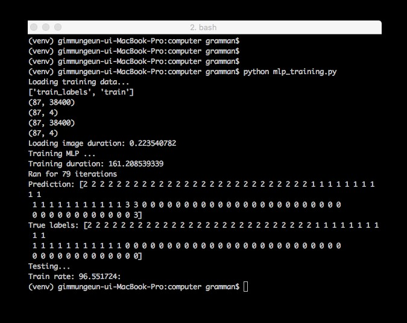

.. demo2.rst

==========
Demo 준비2
==========

Machine Learning 순서
=====================

Machine Learning 진행 순서입니다.

	#. 학습하고자 하는 대상을 Camera를 통하여 촬영하고 사람이 답을 알려 줍니다. 
	#. 그 결과 이미지에 Labelling이 진행이 되고, 해당 이미지를 가지고 Machine Learning을 수행합니다.
	#. Machine Learning을 수행한 결과를 xml파일로 생성을 합니다.
	#. 실제 적용시 xml을 Load하고, Camera에 촬영된 내용을 학습된 Data를 기반으로 판단을 합니다.

위 내용을 보면 사람을 학습시키는 방법과 유사합니다.

위 순서를 바탕으로, 카메라에 숫자를 보여주고, 상하좌우 버튼을 통해서 학습 시킨 후에 숫자를 보여주면 상하좌우와 연결된 LED가 깜빡이는 시나리오 입니다.

Machine Learning 학습 
=====================

학습용 Data 생성
----------------

학습에 사용할 숫자 모형을 준비합니다. 그리고 Computer에서 ``computer/collect_training_data.py`` 를 수행합니다. 

>>> python collect_training_data.py

Raspberry Pi에서는 ``RaspberryPi/stream_client.py`` 를 수행합니다.

>>> python stream_client.py

그러면 ``computer/training_images`` 폴더에 이미지 파일이 계속 생성이 됩니다. 이제 카메라로 숫자 4모형을 촬영하면서 좌측 화살표를 누릅니다. 이과정이 숫자 4 이미지에 좌측버튼 값(0)을 Labelling하는 과정입니다. 약 1분정도 버튼을 누르고 있습니다.
다음으로 숫자 8을 촬영하면서 우측 버튼을 누르고 있습니다. 동일하게 숫자 1를 촬영하면서 위쪽 버튼 , 숫자 3을 촬여하면 아래 버튼을 누르고 있습니다. 

각각 1분정도 진행을 한 후에 ``q`` 를 누르면 작업이 종료가 되고, 총 촬영된 이미지와 Labelling된 이미지, 버려진 이미지 갯수가 나타납니다.

작업이 종료가 되면 Labelling된 이미지의 정보가 numpy파일로 ``computer/training_data_temp/test08.npz`` 로 저장이 됩니다.
이 파일을 ``computer/training_data`` 폴더로 복사 합니다. 이제 이 파일을 이용하여 학습을 진행합니다.

학습하기
-------

학습은 ``computer/mlp_training.py`` 를 수행하면 됩니다.

>>> python mlp_training.py

약 몇분이 소요가 되고 학습 결과가 ``computer/mlp_xml/mlp.xml`` 파일로 생성이 됩니다.

학습시 사용하는 알고리즘은 다층 퍼셉트로 신경망(Multi Layer Perceptron)을 이용하고 있습니다. 

테스트 
------

이제 실제 숫자 모형을 보여주면 연관된 LED가 깜빡이는지 테스트를 진행하겠습니다.

Computer에서 ``computer/rc_driver.py`` 를 수행합니다.

>>> python rc_driver.py

Raspberry Pi에서 ``raspberryPi/stream_client.py`` 를 수행합니다.

>>> python stream_client.py

이제 카메라로 숫자를 촬영하면 이전에 학습한대로 LED가 깜빡이는것을 볼수 있습니다. 
이제 무선 Controller의 건전지를 제거하고, 아래와 같이 LED에 연결된 선을 무선 Controller를 연결합니다. 
일반적으로 1~2만원대 중국산 RC Car Controller는 아래와 유사합니다.

.. figure:: ../../_static/99.demo/image05.jpg
    :align: center

이제 숫자를 보여주면 바퀴가 전진, 후진, 좌/우 방향 전환 되는 것을 확인할 수 있습니다.

